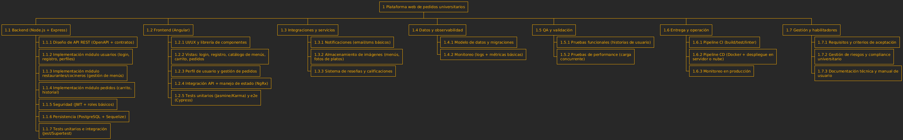

# Proyecto: Plataforma web de pedidos universitarios

---

## 1. EDT (Estructura de Desglose del Trabajo / WBS)

---

## 2. OBS (Organizational Breakdown Structure)

---

## 3. Diccionario WBS

| Código WBS | Entregable | Descripción | Criterios de aceptación | Responsable(s) |
|------------|------------|-------------|-------------------------|----------------|
| 1.1.1 | Diseño de API REST | Definir contratos y endpoints para usuarios, menús y pedidos | Documentación OpenAPI publicada y revisada | Líder Backend |
| 1.1.2 | Módulo usuarios | Login, registro y perfiles | Usuario puede registrarse, iniciar sesión y editar perfil | Dev Backend |
| 1.1.3 | Módulo restaurantes/cocineros | CRUD de menús y platos | Cocinero puede crear, editar y listar menús | Líder Backend |
| 1.1.4 | Módulo pedidos | Carrito y seguimiento | Pedido puede crearse, actualizarse y consultarse | Dev Backend |
| 1.1.5 | Seguridad JWT | Autenticación con tokens | Login genera token válido, expiración y roles | Líder Backend |
| 1.2.1 | UI/UX + librería | Diseño de interfaz y componentes | Vistas responsivas y usables en móvil | Líder Frontend |
| 1.2.2 | Vistas principales | Login, catálogo, carrito, pedidos | Cada vista funcional, enlazada al backend | Dev Frontend |
| 1.2.3 | Manejo de estado (NgRx) | Control de sesión y pedidos | Estado centralizado y persistente | Líder Frontend |
| 1.3.1 | Notificaciones básicas | Emails/sms de confirmación | Usuario recibe confirmación de pedido | Dev Backend |
| 1.3.2 | Almacenamiento de imágenes | Fotos de menús y platos | Se pueden subir y visualizar imágenes | Dev Frontend |
| 1.3.3 | Reseñas y calificaciones | Sistema simple de feedback | Usuario puede puntuar y comentar | Dev Backend + Dev Frontend |
| 1.4.1 | Modelo de datos | Tablas y relaciones | Migraciones ejecutadas sin errores | Líder Backend |
| 1.5.1 | Pruebas funcionales | Validación de historias de usuario | Casos de prueba ejecutados con éxito | QA (Persona 2 + Persona 4) |
| 1.6.1 | Pipeline CI | Linter, tests automáticos | Build y tests corren en cada push | DevOps (Persona 1 + Persona 3) |
| 1.6.2 | Pipeline CD | Docker + despliegue básico | App desplegada en servidor o nube | DevOps (Persona 1 + Persona 3) |
| 1.7.1 | Requisitos y criterios | Documentación del alcance | Documento revisado y firmado | Todo el equipo |

---

## 4. Matriz RACI

**Roles:**
- **Persona 1** → Líder Backend  
- **Persona 2** → Dev Backend  
- **Persona 3** → Líder Frontend  
- **Persona 4** → Dev Frontend  

| Entregable | P1 (Líder Back) | P2 (Dev Back) | P3 (Líder Front) | P4 (Dev Front) |
|------------|-----------------|---------------|------------------|----------------|
| Diseño de API REST | A/R | C | C | I |
| Módulo usuarios | C | R | I | I |
| Módulo restaurantes | A/R | R | I | I |
| Módulo pedidos | A | R | C | I |
| Seguridad JWT | A/R | C | I | I |
| UI/UX + librería | I | I | A/R | C |
| Vistas principales | I | I | A | R |
| Manejo de estado (NgRx) | I | I | A/R | C |
| Notificaciones | A | R | I | I |
| Almacenamiento imágenes | I | I | C | R |
| Reseñas/calificaciones | C | R | C | R |
| Modelo de datos | A/R | C | I | I |
| Pruebas funcionales | C | R | C | R |
| Pipeline CI | A/R | C | A/R | C |
| Pipeline CD | A/R | C | A/R | C |
| Requisitos y criterios | A | R | A | R |

**Nomenclatura:**  
- **R** = Responsible (ejecutor principal)  
- **A** = Accountable (dueño del entregable, toma decisiones)  
- **C** = Consulted (se consulta su opinión)  
- **I** = Informed (se mantiene informado)  
